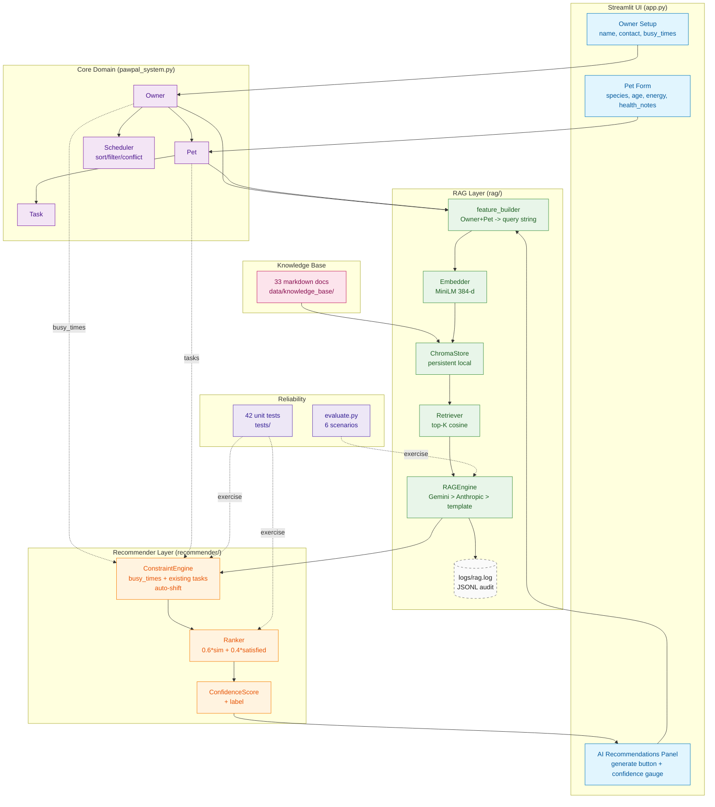

# PawPal+ AI — System Architecture

This file is the source of truth for the system diagram. Render it with the [Mermaid Live Editor](https://mermaid.live), then export `architecture.png` into this folder for the README. Free Mermaid accounts cap at 3 stored charts; the Live Editor has no such limit.

## Mermaid source

https://mermaid.live/edit#pako:eNp9Vm1v2kgQ_isr90vaGrABgyGnSkBMmksCEc7lpDMntLbHYOG37q6bclX_-43XGGxSBUtoZ3aemdmZedb-qXipD8pYCaL01dtRJsjzzToh-OO5u2U025G_7py1YgsGNI5CgSK5olnWzg4f18q_pW3xW_69sFab-XL16CxfE2DEBpFnf7is8yWhMajESxNBPaESN-eHjQhj4DX4k_Vcgp9AkHnKYonkGXghcJXQLXoAdLs9qGQHNBK7TZKKhovJ3eZpsrAenMkdWYGXxjEkPhVhmnDyRBOIpMtt4YUKwDSESBPyuUgsCH1IPCBbmm_h6BLB6-SiFrPlysJqzFIG5CaNaZiQq4y-ZjTa8AMXEP--LGVFmqctDlrTPE_se-eZ8n1NZ8--WjeO7e3AzyNgZUVSJjpBGAlgnSLxKPTEOwmvJreYL_6TB3rAplwxuu00M5xPnQCoyBls3DyM_GMgmfLnohutL-RbDuxAuGBhsq1BrcepY8Uu-BXoMUzCh0fSM_stv2b3YjuzHcN62QIrJy0zYDzEiiWCRKlHo5r1CouzAowF349uRZq17rFPPEygHn5x6-DRrGSLeml4CzFmQL6QSSIwYBZ6uMa2ZBF2vIZ8WN46V1G65R2sRxsXEv2nvVw8EJr7ofj4Tk3vp1jS-yR9jcDfAplSDo2C3ixnttPrkZiyvZ--JsRPPS4D4DTSzr5CblxEdt5rnjUrmleNMravauJZddHMmeXMcN4Fw9EUtcKcOYcDDz-w8thJInDeysxoLtIW34VBfSZXk8W9s6LJ_tgGrT34xMMYPWjt_ieO1OJBCPVGz5aLeZHAkU-2V7X7M4moC9E7h7VeJg_ytFFI3RBvmkPjYM-W_Ww7_S7JE7yEkPiiTFyuOjXDr5PVwrJtB77TKMeuIyOl4YBwDxLKwpS_zeJ8eZEWjrsUy53qXpJ6FGr2TRUupKIg8qWRJHIVq7qm5M58emlbaSp_lTyfShEpV8rFlEnNi10qcKchv5TbqyrB1dEhsuYIWNxKBZKhqZhZjaTa5-Fp13Zlgm05QnX1zCrD4uwc4-KqdIvDcbTBlVRVtahqI7uMXuEHMC_kUHf8u71zlGPbL_blWUsDL6Kc30BA8lDOCd6h0fgD6IERgIqESfcw_qB1h0PXV700ShlKujEcudcX-GKmT_igB0ZgnPBDVw9ot8L3qd43vUs83ji1-GZgwOiE75km9LwKr7sGdLU3ePDO-CDADLQTPjCGnqZVeBgYuvYGv3dr5w886IN3wntd3TTcCm-aGvSDS3xBrHP-PgyDwQlvQM9w9Qrf03V31L3EcyELeIxPi-eEH-jFU-G7evEcN1s-5fiBwuhhbBDjutHWGn_VirDqiWd5eP3GtjBTC6qqkpuyqQ2r-VRFQqkvtoq8UQtmYN8aFjNLLcZPlcOMTWlsSnbuG7NTDrBaDWpRxsY20rCszbWiKlsW-spYsBxUJQaGXxooKj8L-7UidhDjK2eMSx_fMWtlnfxCTEaTf9I0rmAszbc7ZRzQiKOUZ_jygZuQ4m0bn7RMvkNmaZ4IZaxrpnSijH8qP1AcjdojbWD2B4PRQDP7o56qHJRxSzfafXM0GhpdUzPNgab_UpX_ZFy9rWu9vtHTurqh94c9_df_XS4gew

## Data flow narrative

1. The user fills the **Owner Setup** form (`name`, `contact`, `busy_times`) and adds **Pets** (`species`, `age`, `energy`, `health_notes`).
2. Clicking "Generate AI schedule" calls `feature_builder.build_query(owner, pet)` which produces a natural-language query embedding the relevant signals.
3. On first run, `ChromaStore.ingest_knowledge_base()` loads all 33 markdown files, parses YAML frontmatter, chunks each by paragraph (≤1000 chars), embeds them with MiniLM, and upserts into a persistent local Chroma collection at `./data/chroma/`.
4. `Retriever.top_k()` returns the 5 most-similar chunks via cosine similarity.
5. `RAGEngine.generate()` cascades through providers:
   - **Gemini** (`GEMINI_API_KEY`, free tier) — calls `gemini-2.0-flash` with the chunks as `<context>` and parses a strict-JSON response containing `proposed_tasks`, `explanation`, `citations`. Used by default when the key is set.
   - **Anthropic Claude** (`ANTHROPIC_API_KEY`, paid) — same prompt + JSON schema, used if Gemini is unavailable.
   - **Deterministic template** — falls back to a species/energy plan grounded in the retrieved citations if both LLMs are unavailable.

   The `Recommendation.provider` field records which path served the request.
6. The medical-claim guardrail scrubs any rationale that looks like medical advice and appends an "advisory only" warning.
7. `recommender.constraint_engine.validate_slots()` partitions the proposed slots into `kept` and `dropped`, auto-shifting violators to the next valid 15-minute window.
8. `recommender.ranker.rank_slots()` orders the survivors by `0.6 × avg_similarity + 0.4 × satisfied`.
9. `recommender.ranker.confidence_score()` produces the final `[0,1]` confidence and bucketed `high/medium/low` label.
10. The Streamlit AI Recommendations panel renders the schedule table, dropped-slot inspector, citations, and confidence gauge — and offers a one-click "Add all kept tasks to pet" button that writes them into the existing Scheduler.
11. Every generation is appended as a JSON line to `logs/rag.log` for auditability.

## To export PNG for the README

1. Open the Mermaid block above in [mermaid.live](https://mermaid.live).
2. Use **Actions -> Download PNG** (or copy the URL of the PNG export).
3. Save as `assets/architecture.png` next to this file.
4. The README references it as ``.
